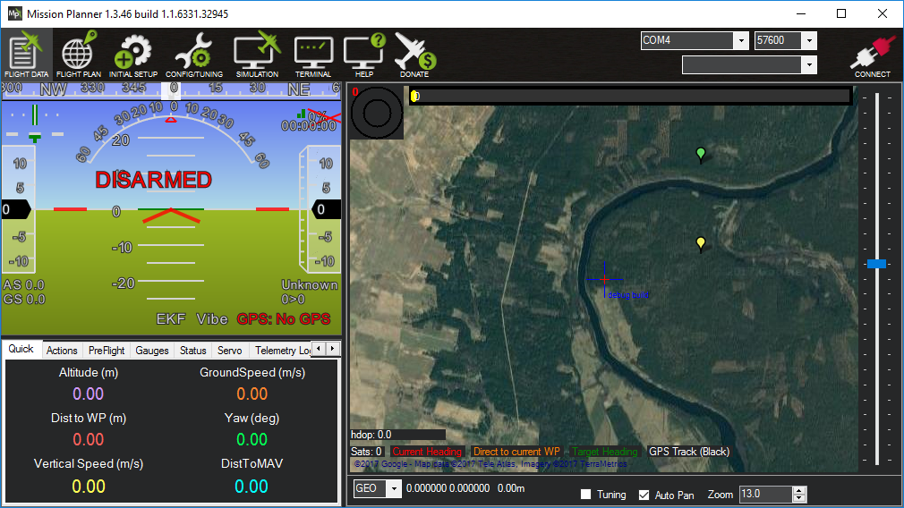
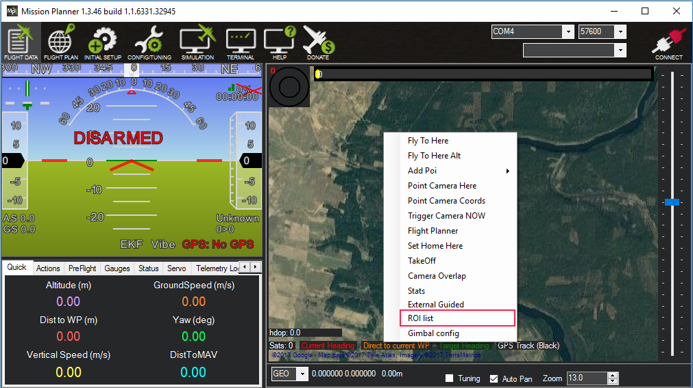
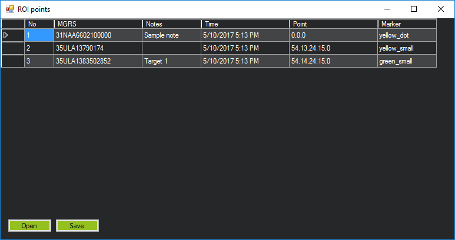

# RoiTracking
This plugin presents a possibility to track interesting points where gimbal is looking to.

Shortkeys:
- Alt + L - add the point where gimbal is looking to, to the tracking list and start loiter around it.
- Alt + T - just add the the point where gimbal is looking to, to the tracking list.
- Alt + R - resume loiter around the last point.

After point is added to the tracking list, that point will be marked on the map exactly there where gimbal was looking to:

Also you can see the list choosing the "ROI list" from the context menu and add notes to each point.

In points list you can set point notes or icon, save points to the file or open previously saved file.
