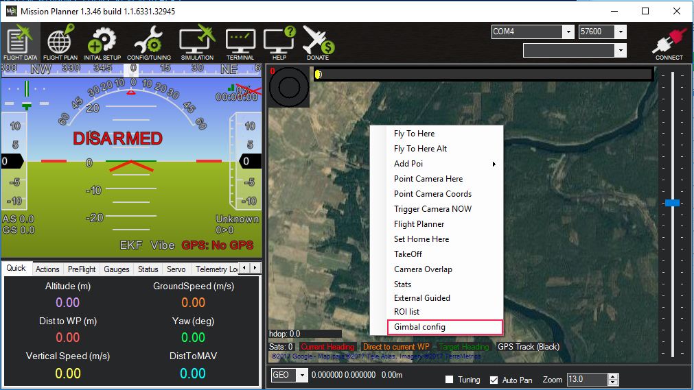
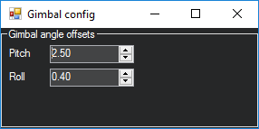

# RollPitchGimbal
Mission Planner calculates correctly where gimbal is looking at (lat/lng) only if gimbal uses both YAW and PITCH control. But if gimbal uses only ROLL and PITCH control then Mission Planner doesn't provide correct latitude and longitude. This plugin fixes that.

To have more precise coordinates or to align camera angle properly, you can adjust camera angles in plugin settings. Open settings choosing "Gimbal config" from context menu:

And adjust pitch and roll angles:

